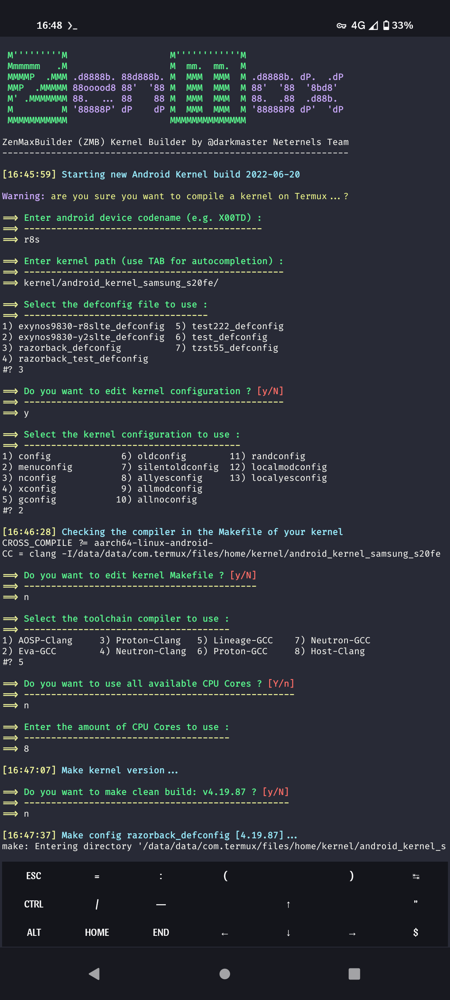

---
{ % seo % }
---

# ZenMaxBuilder  Neternels Team

## Requirements

Dependencies will be prompted to install or you can manually install them.

    bash git zip llvm lld clang expect openjdk (java)

## Usage

➡️ Clone the repository

    git clone https://github.com/grm34/ZenMaxBuilder.git

➡️ Enter ZenMaxBuilder repo and edit [zmb.cfg](https://github.com/grm34/ZenMaxBuilder/blob/zmb/zmb.cfg)
to set your settings (optional)

    cd ZenMaxBuilder && vi zmb.cfg

➡️ Start ZenMaxBuilder and follow instructions

    bash zmb --start

## Options

    Usage: bash zmb [OPTION] [ARGUMENT] (e.q. bash zmb --start)

    Options
        -h, --help                      show this message and exit
        -s, --start                     start new kernel compilation
        -u, --update                    update script and toolchains
        -l, --list                      show list of your kernels
        -t, --tag            [v4.19]    show the latest Linux tag
        -m, --msg          [message]    send message on Telegram
        -f, --file            [file]    send file on Telegram
        -z, --zip     [Image.gz-dtb]    create flashable zip

## Working structure

    ZenMaxBuilder/
    |
    |---- builds/               # Flashable kernel zips
    |     |---- DEVICE1/
    |     |---- DEVICE2/
    |
    |---- logs/                 # Compilation build logs
    |     |---- DEVICE1/
    |     |---- DEVICE2/
    |
    |---- out/                  # Kernel working directories
    |     |---- DEVICE1/
    |     |---- DEVICE2/

## Screenshot

## License

    MIT License

    Copyright (c) 2021-2022 @grm34 Neternels Team

    Permission is hereby granted, free of charge, to any person
    obtaining a copy of this software and associated documentation
    files (the "Software"), to deal in the Software without restriction,
    including without limitation the rights to use, copy, modify, merge,
    publish, distribute, sublicense, and/or sell copies of the Software,
    and to permit persons to whom the Software is furnished to do so,
    subject to the following conditions:

    The above copyright notice and this permission notice shall be
    included in all copies or substantial portions of the Software.

    THE SOFTWARE IS PROVIDED "AS IS", WITHOUT WARRANTY OF ANY KIND,
    EXPRESS OR IMPLIED, INCLUDING BUT NOT LIMITED TO THE WARRANTIES OF
    MERCHANTABILITY, FITNESS FOR A PARTICULAR PURPOSE AND NONINFRINGEMENT.
    IN NO EVENT SHALL THE AUTHORS OR COPYRIGHT HOLDERS BE LIABLE FOR ANY
    CLAIM, DAMAGES OR OTHER LIABILITY, WHETHER IN AN ACTION OF CONTRACT,
    TORT OR OTHERWISE, ARISING FROM, OUT OF OR IN CONNECTION WITH THE
    SOFTWARE OR THE USE OR OTHER DEALINGS IN THE SOFTWARE.

## Credits

- Neternels Team: [https://neternels.org](https://neternels.org)
- Proton-Clang: [@kdrag0n](https://github.com/kdrag0n)
- Eva-GCC: [@mvaisakh](https://github.com/mvaisakh)
- AnyKernel3: [@osm0sis](https://github.com/osm0sis)

## Links

- Source Code: [github](https://github.com/grm34/ZenMaxBuilder)
- Codiga Code Review:
  [link](https://app.codiga.io/public/project/23638/ZenMaxBuilder/dashboard)
- Codefactor Code Review:
  [link](https://www.codefactor.io/repository/github/grm34/zenmaxbuilder)
